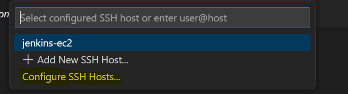

# SSH into EC2 from VS Code

1. Create AWS access keys and set them up in your terminal to deploy resources through `awscli`.
```
aws configure
```
Then paste in the **access key** and **secret key** values. See the example below.


2. Install SSH client by adding the extention `Remote - SSH`


3. Modify the configuration file
* If **SSH'ing** from a linux machine (i.e. Ubuntu):
```
Host aws-e2
    HostName <Public IPv4 DNS>
    User <ec2-name-here>
    IdentityFile ~/.ssh/private-ssh-key.pem
```
* If **SSH'ing** from a Windows machine (i.e. Window 10):
```
Host aws-e2
    HostName <Public IPv4 DNS>
    User <ec2-name-here>
    IdentityFile C:\path_to_public_key_file
```


4. SSH into the EC2
5. Click the green button in lower left corner


6. Click on `Connect to Host...`.
7. Click on `Configure SSH Hosts...`.


8. Click the path with `C:\Users\...\.ssh\config`


9. Edit the file in step 3 and save it.
10. Click the `Open the Remote Window` - Green button on the lower left corner. Select the hostname you setup in the config file.


11. Select the `OS`.


12. Click `Continue`

13. If you encounter errors, check your [SSH Key](https://www.baeldung.com/linux/ssh-key-format-issues-invalid-format-error) set up.

14. If everything goes well, you should see this:


15. Open folders - Check on `Yes, I trust the authors`


16. Here is a side by side SSH from `VS Code` (*left-side*) and `Windows WSL` (*right-side*).


