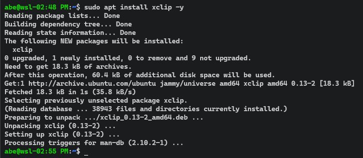
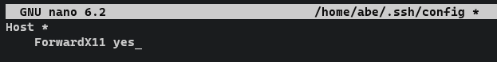
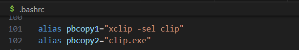

## pbcopy on Ubuntu/Linux
pbcopy is a tool available on Mac.<br>
Here, we will document how this tool can be used in Lunix - Ubuntu.

### Install xclip
* Run the commands below in order:<br>
```
sudo apt update -y && sudo apt upgrade -y
sudo apt install xclip -y
```


* After installation, type `which xclip` on the teminal to verify:<br>


* To learn more about `xclip` type `man xclip` on the terminal to more options for the command.
* Create an alias
* Open the file `.bashrc` and add the alias below<br>
```
alias pbcopy="xclip -sel clip"
```


* Restart the terminal!

### Testing
* Test command pbcopy
* To test the command we will execute the command below to copy a public ssh key:<br>
```
pbcopy1 < ~/.ssh/<key_name>.pub
```

### Getting Errors?
* If you get this error below, then do the following step:<br>


* Add this forward set up in `~/.ssh/config` file
* Go to the `config` file<br>


* Then add<br>


* Save and exit from the code editor and restart the terminal
* Try the `pbcopy` command again!
* If you still continue having the same error, use the command `clip.exe` instead of `xclip -sel clip`
* For this, reset the alias command and add:
```
alias pbcopy2="clip.exe"
```


* Then run the command `pbcopy2 < ~/.ssh/<*key_name*>.pub` after restarting the terminal.<br>
* It should show like this:<br>


* And now you cam paste the public ssh key where you want!

### Sources:
1. [xclip](https://packages.debian.org/stable/x11/xclip)
2. [Copy SSH keys](https://hklish01.github.io/gettingtoknowgit/set_up_keys.html)
3. [git push fix](https://www.golinuxcloud.com/fatal-could-not-read-from-remote-repository/)