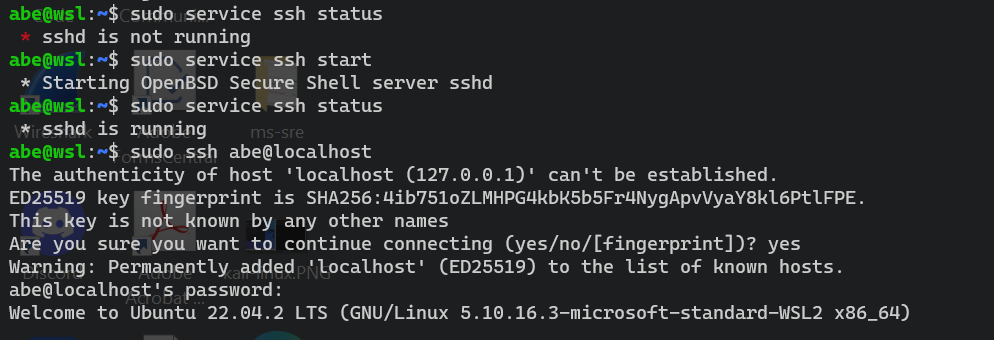

# Systemd, Service and SSH
## Enable Systemd (to SSH) in Windows10 WSL

First, you can install [WSL](https://ubuntu.com/tutorials/install-ubuntu-on-wsl2-on-windows-10#1-overview) if you do not have it already.

### With Systemctl

1. Check the status:
```
sudo systemctl status sshd
```
2. if you see the error below, edit the file **wsl.conf**.


3. Nano into the **wsl.conf**


4. Add this:
```
[boot]
systemd=true
```


5. Then restart the terminal and retry again. <br>
6. If it still fails, thry the old **service** command.

### With Service
1. Run this:
```
sudo service ssh status
```

2. You can then start the service by using the command below:
```
sudo service ssh start
```
3. You will see the this. Allow the access.


4. You can now check the status.
```
sudo service ssh status
```


5. Use this to stop the service
```
sudo service ssh stop
```


## Validate SSH on Windows10 WSL
Once you are able to check the **ssh** status, you can proceed to setup the **ssh**.
1. Install OpennSSH server:
```
sudo apt update -y
sudo apt install openssh-server
```

2. Start the service and validate the OpenSSH service by ssh'ing into the localhost.<br>
Enter the password when prompted.
```
sudo service ssh start
sudo ssh user_name@localhost
```


3. Now you can exit by just typing **exit**.
