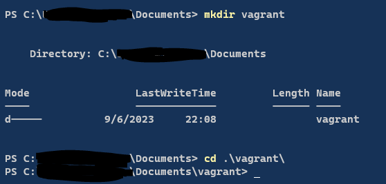
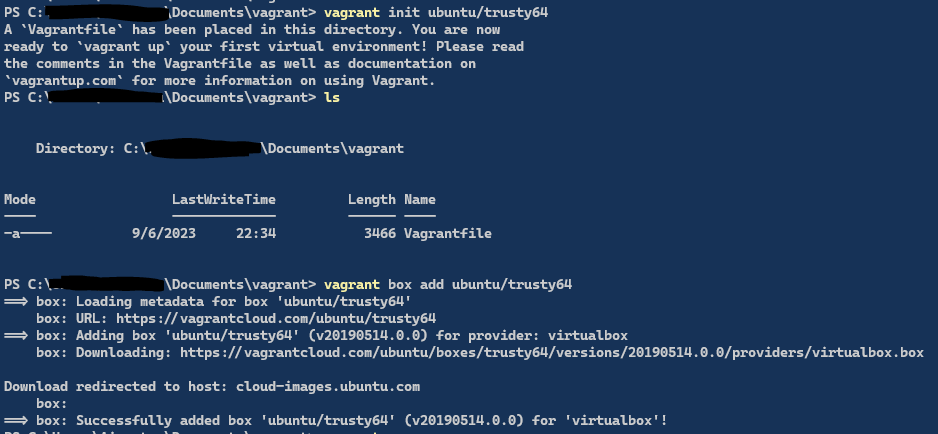
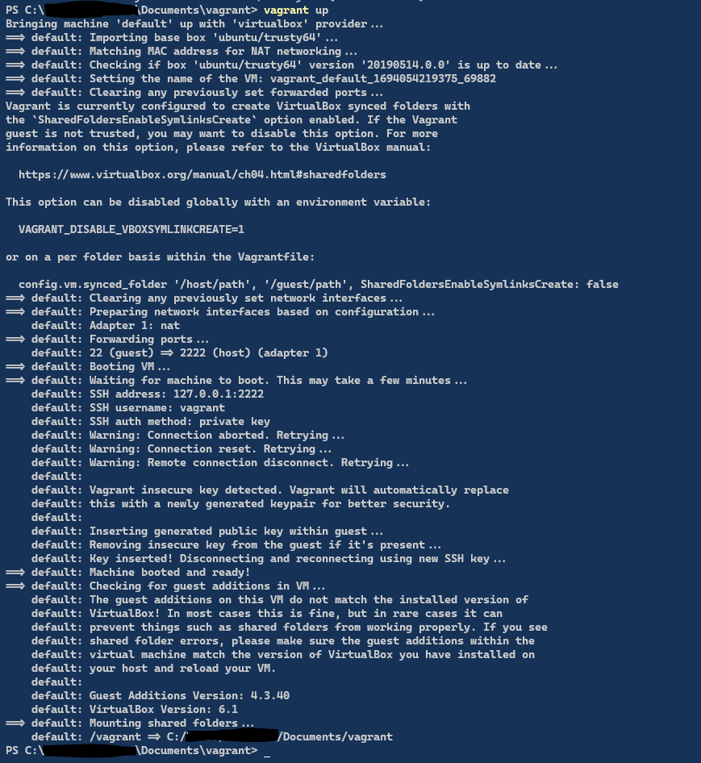
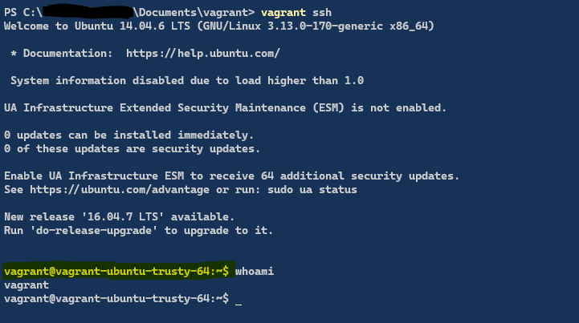
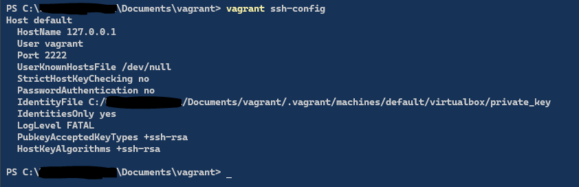
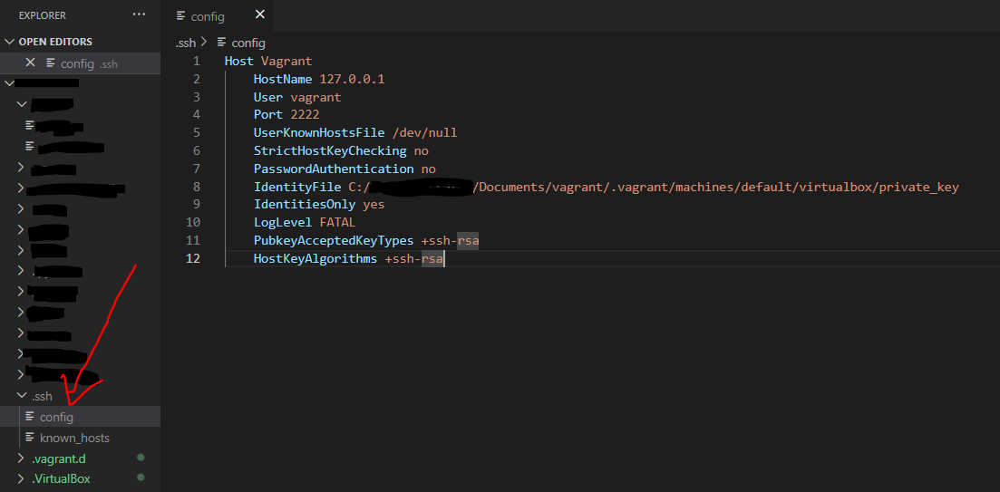
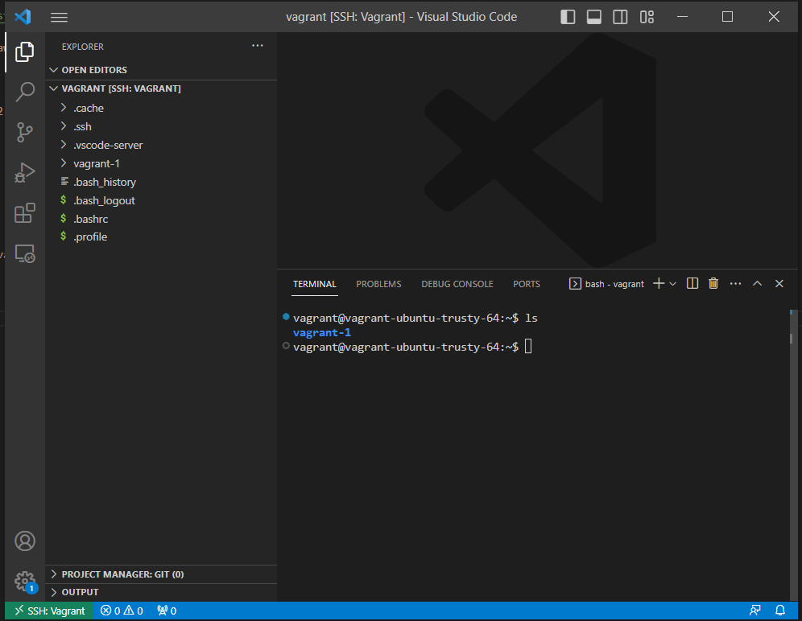
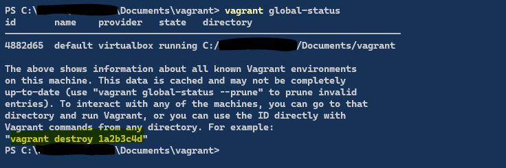
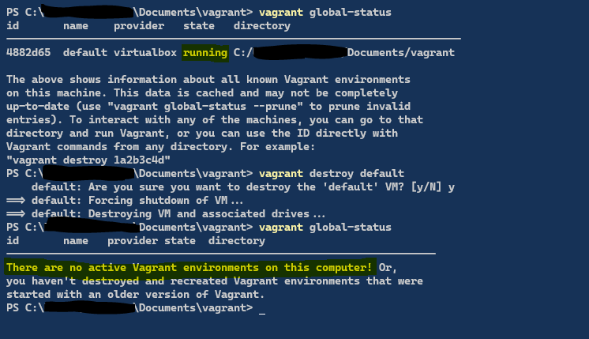

## Set Up Vagrant to VSCode

### 1. Set up Vagrant
* Install [Virtualbox](https://www.virtualbox.org/wiki/Downloads). You can also use other providers.
* Install [Vagrant](https://developer.hashicorp.com/vagrant/downloads)
* Create a directory and cd into it<br>

* Note that after installation, you might need to restart your computer
* Run the commands below in order to download a box or follow the [Hashicoro](https://developer.hashicorp.com/vagrant/tutorials/getting-started/getting-started-install) documentation
* You can find a Vagrant Box in [Varant Cloud](https://app.vagrantup.com/boxes/search) - we are using **ubuntu/trusty64** VM for testing
```
vagrant init ubuntu/trusty64
vagrant box add ubuntu/trusty64 #Optional if previous command was run
```


* Now you can start up the VM
```
vagrant up
```


* SSH into the Ubuntu VM by running 
```
vagrant ssh
```

* To leave the the VM just type `exit`

### 2. SSH to Vagrant via VSCode
* Run `vagrant ssh-config`

* Copy the output into the `.ssh/config` file in you local machine 
```
Host default
  HostName 127.0.0.1
  User vagrant
  Port 2222
  UserKnownHostsFile /dev/null
  StrictHostKeyChecking no
  PasswordAuthentication no
  IdentityFile C:/<your_path>/Documents/vagrant/.vagrant/machines/default/virtualbox/private_key
  IdentitiesOnly yes
  LogLevel FATAL
  PubkeyAcceptedKeyTypes +ssh-rsa
  HostKeyAlgorithms +ssh-rsa
```


* To start the VSCode, follow same steps used in  [SSH into EC2 From VS Code](https://github.com/ibrahima1289/troubleshooting/blob/main/Linux/ec2-vscode-ssh.md) from `step 5`.
<br> You will get somrthing like this:


### 3. Clean Up
* To see running VMs, run `vagrant global-status`


* To destroy, just run
```
vagrant destroy <id_or_namw>
```


* See [Vagrant CLI](https://developer.hashicorp.com/vagrant/docs/cli) for more info on Vagrant commands.