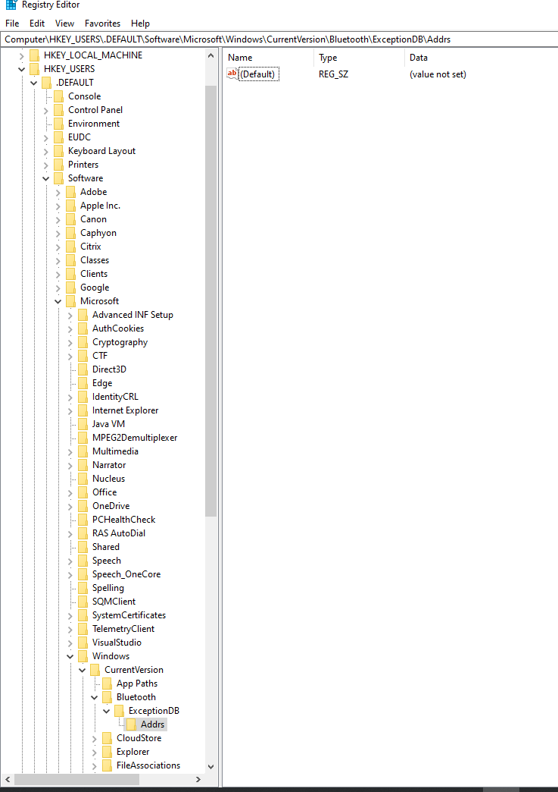

## Cannot find Apple Keyboard PIN?

1. First, right-click on the Windows icon
2. Click on run
3. Then enter **regedit** to open the **registry keys**
4. Go to 
```
Computer\HKEY_USERS\.DEFAULT\Software\Microsoft\Windows\CurrentVersion\Bluetooth\ExceptionDB\Addrs
```



5. And **delete** the registry key
6. Try reconecting the keyboard again, you will see the **PIN** again
